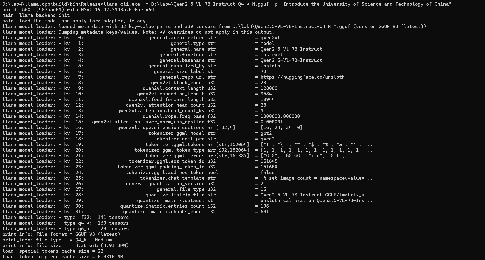
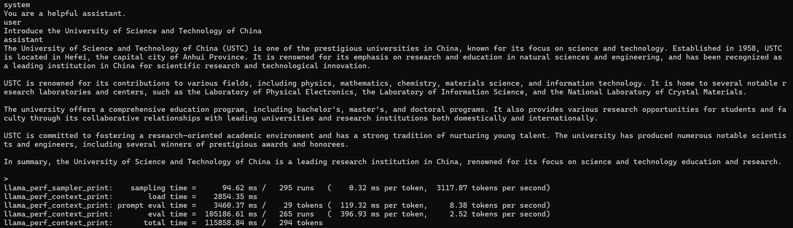

# Qwen2.5-VL-7B-Instruct-Q4_K_M基于llama.cpp的单机部署说明文档
## 一、部署目标
本说明文档旨在详细记录如何使用llama.cpp工具在单机环境中部署Qwen2.5-VL-7B-Instruct-Q4_K_M模型，为后续的模型性能测试与优化提供基础。

## 二、模型信息
1. **模型名称**：Qwen2.5-VL-7B-Instruct-Q4_K_M
2. **模型来源**：从Hugging Face下载，具体下载链接为https://huggingface.co/unsloth/Qwen2.5-VL-7B-Instruct-GGUF 。该模型属于通用GGML统一格式（GGUF），4bit量化版本为Q4_K_M，在压缩模型体积的同时，保持较好的推理性能，适用于资源有限的单机环境部署。
3. **模型参数**：76.2亿参数，适用于多种自然语言处理任务，如文本生成、问答等。

## 三、环境要求
1. **操作系统**：Windows 11 64位
2. **硬件配置**：
    - CPU：建议多核处理器（如8核及以上），以提高推理效率。
    - 内存：16GB及以上，模型文件约4.68GB，推理过程中会占用一定内存，确保系统有足够内存运行。
3. **软件依赖**：
    - Visual Studio（用于编译llama.cpp，建议安装Visual Studio 2019及以上版本，安装时需勾选“使用C++的桌面开发”工作负载，确保安装C++生成工具）。
    - CMake：用于构建llama.cpp项目，需下载并安装CMake，安装后将其添加到系统环境变量中，确保在命令行中可直接使用。
    - Git（可选，用于从GitHub获取llama.cpp源代码，若已手动下载源代码压缩包则无需安装）。

## 四、部署步骤
### （一）下载llama.cpp源代码
1. 打开终端（Windows用户可使用命令提示符或PowerShell）。
2. 使用Git命令克隆llama.cpp仓库（若未安装Git，可直接从GitHub页面https://github.com/ggerganov/llama.cpp 下载源代码压缩包，解压到本地目录）：
```bash
git clone https://github.com/ggerganov/llama.cpp.git
```
3. 创建项目目录：
创建一个名为“lab4”的文件夹，将llama.cpp文件夹移动到“lab4”文件夹中。

### （二）下载Qwen2.5-VL-7B-Instruct-Q4_K_M模型
1. 打开浏览器，访问https://huggingface.co/unsloth/Qwen2.5-VL-7B-Instruct-GGUF 。
2. 在页面中找到4bit量化的Q4_K_M版本，点击下载按钮，将模型文件（.gguf后缀）下载到本地。
3. 将下载好的Qwen2.5-VL-7B-Instruct-Q4_K_M.gguf模型文件移动到“lab4”文件夹中。

### （三）编译llama.cpp
1. 在llama.cpp目录下创建一个名为“build”的文件夹，用于存放编译生成的文件：
```bash
mkdir build
```
2. 进入“build”文件夹：
```bash
cd build
```
3. 使用CMake生成Visual Studio项目文件，同时指定生成64位程序，并关闭CURL依赖（避免因找不到CURL库导致编译错误）：
```bash
cmake -B build -G "Visual Studio 17 2022" -A x64 -DLLAMA_CURL=OFF
```
**注意**：上述命令中的“Visual Studio 17 2022”需根据实际安装的Visual Studio版本进行调整，如Visual Studio 2019对应“Visual Studio 16 2019” 。
4. 使用CMake编译项目，生成可执行文件：
```bash
cmake --build build --config Release
```
编译完成后，在“build\bin\Release”目录下会生成llama-cli.exe可执行文件。

### （四）启动模型进行交互
1. 打开终端，切换到“build\bin\Release”目录（即llama-cli.exe所在目录）：
```bash
cd build\bin\Release
```
2. 使用以下命令启动模型并进行交互，以简单文本生成为例，-p参数后跟随提示词：
```bash
llama-cli.exe -m D:\lab4\Qwen2.5-VL-7B-Instruct-Q4_K_M.gguf -p "你的提示词，比如介绍下 AI"
```
**参数说明**：
    - `-m`：指定模型文件路径，使用相对路径指向“models”文件夹中的模型文件。
    - `-p`：后跟要让模型处理的提示词，模型会基于此生成响应。



## 五、退出交互
在与模型交互过程中，若想退出：
1. 当模型处于等待输入状态时，按下`Ctrl + C`组合键，即可终止llama-cli.exe进程，退出交互，回到终端命令提示符状态。
2. 若遇到程序无响应的情况，可按`Ctrl + Shift + Esc`组合键打开任务管理器，找到llama-cli.exe进程，右键选择“结束任务”强制关闭。

## 六、常见问题及解决方法
1. **编译错误-找不到CURL库**：在执行CMake命令时，添加`-DLLAMA_CURL=OFF`参数关闭CURL依赖，如上述编译步骤所示。
2. **运行错误-不支持的16位应用程序**：确保编译生成的是64位程序，在CMake命令中通过`-A x64`参数指定生成64位项目，同时确认操作系统为64位。
3. **模型加载失败-文件不存在或路径错误**：检查`-m`参数后的模型文件路径是否正确，确保项目文件结构正确，且文件名与实际一致。 
