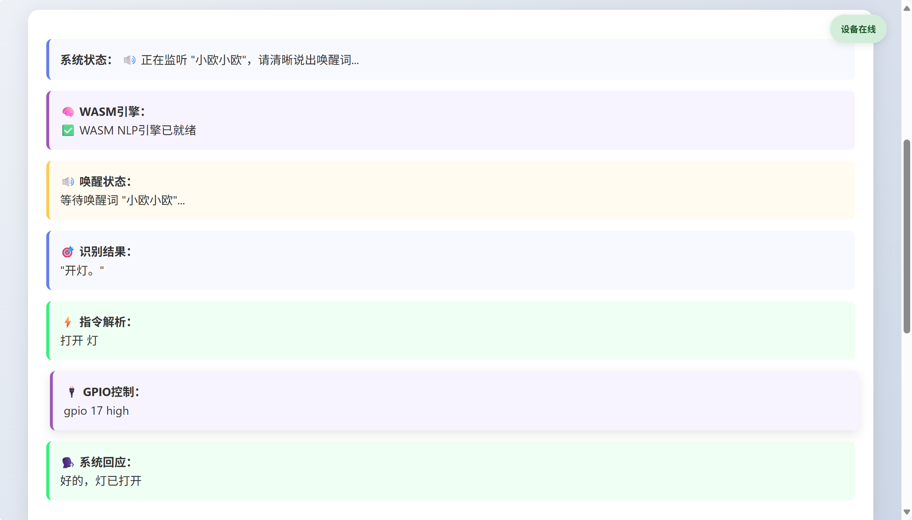

## web_0605使用说明

#### 基本介绍

该文件夹中的内容需要在linux虚拟机的环境下运行，打开终端，输入

`python3 -m http.server 8080`

命令行，选择在浏览器中打开，会立刻进入监听模式

![image-20250605094726121]

进入监听模式之后需要说出唤醒词”小欧小欧“才能进入解析指令的步骤

目前我们已经能够实现指令解析功能，配合wasm的模块使用，并且实现GPIO引脚控制的反馈

我们做出的改进是，不需要只看web上的文字来接受反馈，现在语音识别系统已经能与我们进行语音对话，打开麦克风和扬声器即可进行对话
