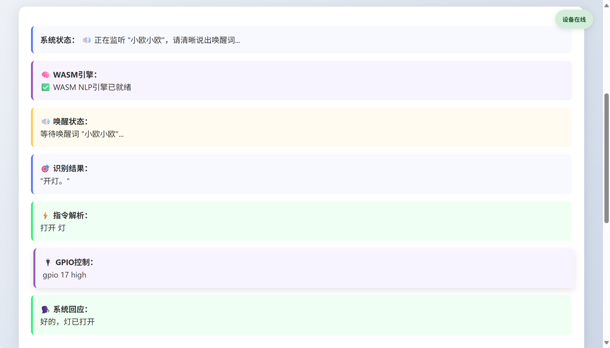
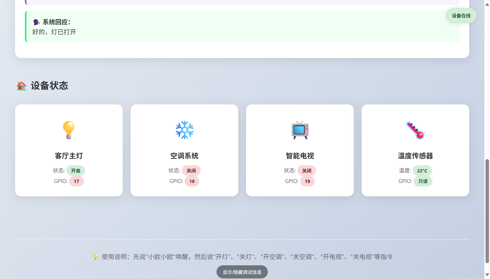
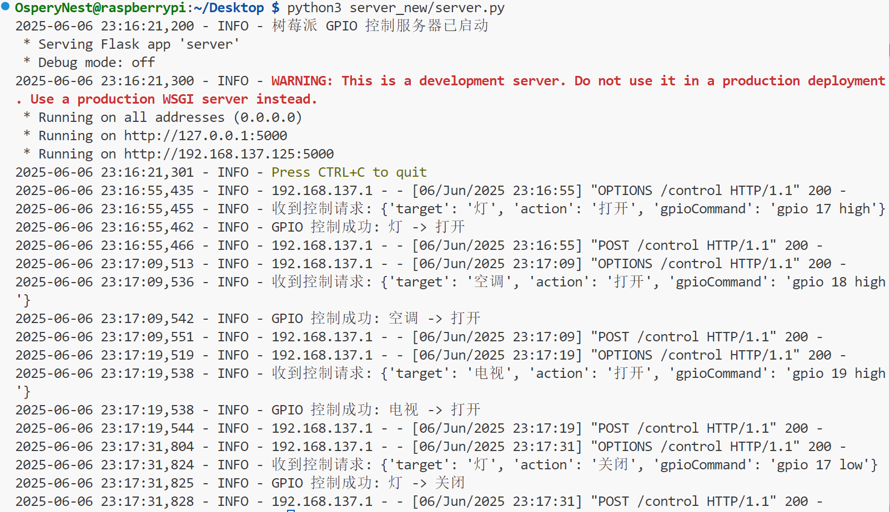

## web_0605使用说明

### 基本介绍

该文件夹中的内容需要在linux虚拟机的环境下运行，打开终端，输入

`python3 -m http.server 8080`

命令行，选择在浏览器中打开，会立刻进入监听模式

进入监听模式之后需要说出唤醒词“小欧小欧”才能进入解析指令的步骤

目前我们已经能够实现指令解析功能，配合wasm的模块使用，并且实现GPIO引脚控制的反馈

我们做出的改进是，不需要只看web上的文字来接受反馈，现在语音识别系统已经能与我们进行语音对话，打开麦克风和扬声器即可进行对话

### server.py使用说明

这段代码是一个基于 Flask 的 Web 服务器，用于通过 HTTP 请求控制树莓派的 GPIO 引脚。

在树莓派终端(根目录下)输入python3 home/OsperyNest/Desktop/server_new/server.py，树莓派即可开始监听端口5000；

此时，说出唤醒词“小欧小欧”和相关指令，可以实现对相关引脚的控制（目前已通过led灯测试）。

flask服务器端详细信息如下：

正在使用多设备访问此服务器。

使用python3 -m http.server 8080 --bind 0.0.0.0，确认 Python HTTP 服务器绑定地址，
WSL2 使用虚拟化网络，外部设备无法直接访问 WSL2 的端口。你需要将 Windows 的 8080 端口转发到 WSL2：

在 WSL2 中运行 ip addr show eth0 | grep inet，找到 WSL2 的 IP 地址（形如 172.x.x.x）。
在 Windows PowerShell（以管理员身份运行）设置端口转发：
powershell
netsh interface portproxy add v4tov4 listenport=8080 listenaddress=0.0.0.0 connectport=8080 connectaddress=wsl_ip
将 <WSL2_IP> 替换为 WSL2 的实际 IP。

确保其他设备和运行 WSL2 的电脑在同一局域网内。

使用netstat -a | findstr 8080确保  TCP    0.0.0.0:8080           LAPTOP-MQF6GGT1:0      LISTENING，
然后在运行wsl2的电脑设置新的防火墙规则打开 控制面板 > 系统和安全 > Windows Defender 防火墙 > 高级设置 > 入站规则。
创建新规则：
类型：端口
协议：TCP
端口：8080
允许连接
其他与电脑处于同一局域网下的设备即可访问：http://192.168.177.82:8080

现可以使用手机端，电脑端多端查看网页，但语音识别仅支持chrome，edge浏览器，现尝试使用本地部署语音识别模型。
