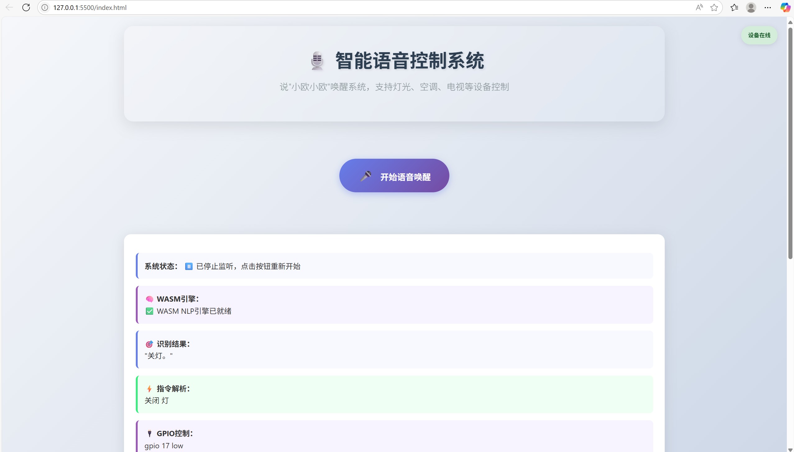

### 用户端测试说明（Windows 系统）

以下是在 Windows 用户端上语音控制树莓派的完整测试说明，请按照步骤操作：

#### **1. 下载测试文件**
1. 访问 GitHub 仓库：[https://github.com/OSH-2025/OspreyNest](https://github.com/OSH-2025/OspreyNest)
2. 进入 `src/用户端测试` 目录（或直接点击此链接：[用户端测试](https://github.com/OSH-2025/OspreyNest/tree/main/src/%E7%94%A8%E6%88%B7%E7%AB%AF%E6%B5%8B%E8%AF%95)）
3. 下载以下 4 个文件到本地电脑：
   - `index.html`
   - `nlp-parser.js`
   - `nlp-parser.wasm`
   - `styles.css`

#### **2. 在 VS Code 中打开文件夹**
1. 确保已安装 [Visual Studio Code](https://code.visualstudio.com/)（简称 VS Code）
2. 打开 VS Code，点击顶部菜单 **"文件" → "打开文件夹"**
3. 选择刚才下载的 4 个文件所在的文件夹（例如 `OspreyNest-用户端测试`）

#### **3. 安装并配置 Live Server 扩展**
**步骤 1：安装 Live Server**
1. 在 VS Code 左侧活动栏中，点击 **扩展图标（方块形状）**
2. 在搜索框输入 **Live Server**，选择第一个结果并点击 **"安装"**
3. 安装完成后，底部状态栏会出现 **Go Live** 选项

**步骤 2：设置默认浏览器为 Edge**
1. 打开 VS Code 设置
2. 在搜索框输入 **Live Server Browser**
3. 找到 **Live Server: Custom Browser** 设置项
4. 在下拉菜单中选择 **edge**
5. 保存设置后重启 VS Code

#### **4. 启动测试页面**
1. 在 VS Code 终端输入 **python3 -m http.server 8080**
2. 点击底部状态栏的 **Go Live** 
3. 浏览器（Microsoft Edge）将自动打开，并显示树莓派控制界面

#### **5. 测试功能**
1. **点击开始语音唤醒**：
   - 点击网页中间的 **开始语音唤醒**

2. **说出唤醒词小欧小欧**：
   - 等待网页中间的提示词变为 **正在监听唤醒词...(点击停止)**
   - 清晰说出唤醒词**小欧小欧**，使出现提示词 **小欧已唤醒，请说出指令**

3. **说出指令**：
   - 等待网页中间的提示词变为 **正在监听指令...(点击停止)**
   - 清晰说出指令，如**开灯**、**关灯**
   - 观察树莓派的响应状态

4. **点击停止，完成测试**

#### **注意**
1. 当前电脑需要连接指定网络才可测试
- 若使用时语音输出后网页右上角显示绿色字体**设备在线**，则网络连接正确
- 若使用时语音输出后网页右上角显示红色字体**设备离线**，则网络连接错误
2. 语音输入时需要适当间隔而非连续，以保证指令识别正确
