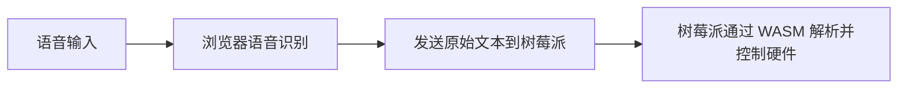
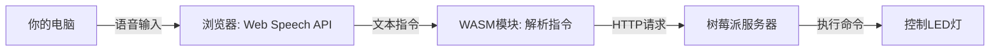
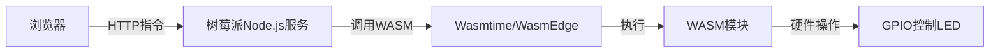

### 一、WASM部署的不同场景
#### **场景 1：WASM 部署在浏览器端（前一个回答）**
- **目标**：在浏览器中通过 WASM **加速语音指令的解析**（例如将“开灯”转换为 `gpio 17 high`），再将解析后的命令发送到树莓派。
- **步骤特点**：
  - WASM 运行在浏览器中（依赖 Emscripten 编译）。
  - 树莓派只需运行一个简单的 HTTP 服务（不涉及 WASM）。
- **适用场景**：需要**在浏览器中处理复杂计算**（如 NLP 模型推理）。

#### **场景 2：WASM 部署在树莓派端（当前回答）**
- **目标**：在树莓派上直接通过 WASM **执行硬件控制逻辑**（例如操作 GPIO），提升安全性和跨平台性。
- **步骤特点**：
  - WASM 运行在树莓派本地（依赖 Wasmtime 或 WasmEdge）。
  - 树莓派需同时运行 HTTP 服务和 WASM 运行时。
- **适用场景**：需要**隔离硬件操作**或复用跨平台代码。

---

### 二、**两种方案对比**
#### 流程对比
| 特性                | WASM 在浏览器端               | WASM 在树莓派端                |
|---------------------|-----------------------------|-------------------------------|
| **语音识别**      | 浏览器完成                                   | 浏览器完成                                   |  
| **指令解析**      | 浏览器通过 WASM 解析文本                     | 树莓派通过原生服务接收文本，直接调用 WASM 模块执行硬件操作 |  
| **硬件控制**      | 树莓派运行原生代码（如 Python）               | 树莓派通过 WASM 运行时执行编译后的硬件控制逻辑 |  
| **WASM 作用**       | 加速指令解析（如 NLP）        | 直接控制硬件（如 GPIO）         |
| **性能瓶颈**         | 浏览器 JavaScript 性能限制   | 树莓派原生代码性能更高          |
| **安全性**          | 浏览器沙箱隔离               | WASM 运行时沙箱隔离            |
| **适用场景**         | 复杂前端计算                 | 安全敏感的硬件操作              |
##### **场景 1：WASM 在浏览器端**  

##### **场景 2：WASM 在树莓派端**  


#### 核心区别
编译位置（浏览器端或树莓派端）只是表象，真正的核心区别在于 **WASM 模块的功能定位** 和 **运行环境**。以下是详细对比：
##### **1. 功能定位差异**
| **方案**               | **WASM 模块的作用**                | **典型场景**                          |
|------------------------|-----------------------------------|---------------------------------------|
| **WASM 在浏览器端**     | **加速前端计算**（如语音指令解析、NLP） | 需要在前端处理复杂逻辑（例如解析“开灯”为 `gpio 17 high`），但 JavaScript 性能不足。 |
| **WASM 在树莓派端**     | **直接控制硬件**（如 GPIO 操作）     | 需要在树莓派上安全、跨平台地执行硬件操作，避免原生代码直接操作硬件的风险。 |
##### **2. 运行环境差异**
| **方案**               | **WASM 运行环境**                 | **依赖工具链**                        |
|------------------------|-----------------------------------|---------------------------------------|
| **WASM 在浏览器端**     | 浏览器 JavaScript 引擎（如 Chrome V8） | - 编译器：Emscripten<br>- 浏览器：需支持 WebAssembly |
| **WASM 在树莓派端**     | 树莓派本地 WASM 运行时（如 Wasmtime）  | - 编译器：Clang（支持 WASI）<br>- 运行时：Wasmtime/WasmEdge |

#### **总结**
1. **核心区别**：  
   - **WASM 在浏览器端**：用于**前端计算加速**（替代 JavaScript）。  
   - **WASM 在树莓派端**：用于**安全执行硬件操作**（替代原生 C/Python 代码）。  

2. **编译差异的本质**：  
   - **浏览器端**：需生成与 JavaScript 交互的胶水代码（Emscripten）。  
   - **树莓派端**：需支持直接操作硬件（通过 WASI 和本地库如 `wiringPi`）。  

3. **如何选择**：  
   - 如果目标是**保护硬件操作逻辑**（如防止代码泄露）或**跨平台复用**（同一份 WASM 在 x86/ARM 设备运行），选择树莓派端部署。  
   - 如果目标是**降低浏览器端计算延迟**（如实时语音指令解析），选择浏览器端部署。  
---

### 三、**针对场景1(WASM 部署在浏览器端)的明确步骤**
#### 总体流程概述
  1. **语音识别**：浏览器通过**Web Speech API**（内置功能）将语音转为文本（如“开灯”）。
  2. **指令解析**：将文本（如“开灯”）转换为树莓派可执行的命令（如`gpio 17 high`），这一步可能涉及复杂逻辑（如NLP），若用JavaScript性能不足，可将C/C++代码编译为WASM加速处理。
  3. **指令传输**：解析后的命令通过HTTP请求发送到树莓派。
#### 总体系统架构

#### **步骤1：树莓派环境配置**
1. **安装Raspberry Pi OS**并启用SSH。
2. **安装Node.js服务器**：
   ```bash
   curl -fsSL https://deb.nodesource.com/setup_18.x | sudo -E bash -
   sudo apt-get install -y nodejs
   ```
3. **编写服务端代码（server.js）**：
   ```javascript
   const express = require('express');
   const app = express();
   app.use(express.json());

   app.post('/execute', (req, res) => {
     const command = req.body.command;
     const { exec } = require('child_process');
     exec(`python3 gpio_control.py ${command}`, (error) => {
       if (error) res.status(500).send('执行失败');
       else res.send('执行成功');
     });
   });

   app.listen(3000, () => console.log('服务已启动'));
   ```

#### **步骤2：浏览器端语音识别**
1. **HTML页面（index.html）**：
   ```html
   <button onclick="startRecording()">按住说话</button>
   <script>
     function startRecording() {
       const recognition = new webkitSpeechRecognition();
       recognition.lang = 'zh-CN';
       recognition.onresult = (event) => {
         const text = event.results[0][0].transcript;
         processText(text); // 调用WASM处理文本
       };
       recognition.start();
     }
   </script>
   ```

#### **步骤3：编译WASM指令解析模块**
1. **安装Emscripten**（需Linux环境或WSL）：
   ```bash
   git clone https://github.com/emscripten-core/emsdk.git
   cd emsdk
   ./emsdk install latest
   ./emsdk activate latest
   source ./emsdk_env.sh
   ```
2. **C代码（command_parser.c）**：
   ```c
   #include <string.h>
   #include <emscripten.h>

   EMSCRIPTEN_KEEPALIVE
   const char* parse_command(const char* text) {
       if (strstr(text, "开灯")) return "high";
       if (strstr(text, "关灯")) return "low";
       return "unknown";
   }
   ```
3. **编译为WASM**：
   ```bash
   emcc command_parser.c -o parser.js -s EXPORTED_FUNCTIONS='["_parse_command"]' -s EXPORTED_RUNTIME_METHODS='["ccall"]'
   ```

#### **步骤4：浏览器调用WASM并发送指令**
1. **在HTML中集成WASM**：
   ```html
   <script src="parser.js"></script>
   <script>
     Module.onRuntimeInitialized = () => {
       window.parseCommand = (text) => {
         return Module.ccall('parse_command', 'string', ['string'], [text]);
       };
     };

     function processText(text) {
       const command = parseCommand(text);
       fetch('http://树莓派IP:3000/execute', {
         method: 'POST',
         headers: { 'Content-Type': 'application/json' },
         body: JSON.stringify({ command: command })
       });
     }
   </script>
   ```

#### **步骤5：树莓派执行GPIO控制**
1. **Python脚本（gpio_control.py）**：
   ```python
   from gpiozero import LED
   import sys

   led = LED(17)
   action = sys.argv[1]

   if action == "high":
       led.on()
   elif action == "low":
       led.off()
   ```

#### **步骤6：测试流程**
1. **启动树莓派服务**：
   ```bash
   node server.js
   ```
2. **在电脑浏览器打开index.html**，点击按钮说“开灯”，观察树莓派LED是否点亮。

---

### 四、**针对场景2(在树莓派上运行 WASM 模块)的明确步骤**
#### 总体流程概述
  1. **语音识别**：浏览器通过**Web Speech API**（内置功能）将语音转为文本（如“开灯”）。
  2. **指令传输**：将文本指令（如“开灯”）通过 HTTP 请求 直接发送到树莓派的 Web 服务。
  3. **树莓派端指令解析与WASM执行**：
   - HTTP 服务接收指令：树莓派运行 Node.js/Python 服务 接收文本指令
   - WASM 解析与硬件控制：
        C 代码编译为 WASM：将硬件控制逻辑（如 GPIO 操作）用 C 编写，编译为 WASM 模块
        通过 Wasmtime 运行 WASM：树莓派调用 WASM 运行时（如 Wasmtime）执行编译后的模块
#### 总体系统架构

#### **步骤 1：树莓派环境配置**
1. **安装依赖工具链**  
   ```bash
   # 更新系统
   sudo apt update && sudo apt upgrade -y

   # 安装编译依赖
   sudo apt install -y clang curl git

   # 安装 Wasmtime（WASM 运行时）
   curl https://wasmtime.dev/install.sh -sSf | bash
   source ~/.bashrc
   ```
2. **验证安装**  
   ```bash
   wasmtime --version  # 输出应类似 wasmtime 12.0.0
   ```

#### **步骤 2：编写 C 代码并编译为 WASM**
1. **创建 C 程序（`gpio_control.c`）**  
   ```c
   #include <stdio.h>

   // 模拟 GPIO 操作（真实场景需调用 wiringPi 等库）
   void gpio_write(int pin, int value) {
     printf("[WASM] 设置 GPIO %d 为 %s\n", pin, value ? "高电平" : "低电平");
     // 实际硬件操作代码（需链接 wiringPi）
     // digitalWrite(pin, value);
   }

   // 导出的 WASM 函数（供外部调用）
   __attribute__((export_name("control_led")))
   void control_led(int state) {
     gpio_write(17, state); // 控制 GPIO 17
   }
   ```

2. **编译为 WASM（支持 WASI）**  
   ```bash
   # 使用 clang 直接编译
   clang \
     --target=wasm32-wasi \
     -nostdlib \
     -Wl,--export-all \
     -Wl,--no-entry \
     -o gpio_control.wasm \
     gpio_control.c

   # 验证 WASM 文件
   wasmtime run gpio_control.wasm --invoke control_led 1
   # 输出：[WASM] 设置 GPIO 17 为 高电平
   ```

#### **步骤 3：树莓派服务端调用 WASM**
1. **安装 Node.js（用于 HTTP 服务）**  
   ```bash
   curl -fsSL https://deb.nodesource.com/setup_18.x | sudo -E bash -
   sudo apt install -y nodejs
   ```

2. **编写服务端代码（`server.js`）**  
   ```javascript
   const express = require('express');
   const { spawnSync } = require('child_process');
   const app = express();
   app.use(express.json());

   // 调用 WASM 模块执行 GPIO 控制
   app.post('/control', (req, res) => {
     const { action } = req.body; // "on" 或 "off"
     const state = action === 'on' ? 1 : 0;

     // 通过 Wasmtime 执行 WASM
     const result = spawnSync('wasmtime', [
       'run',
       '--invoke', 'control_led',
       'gpio_control.wasm',
       state.toString()
     ]);

     if (result.status === 0) {
       res.send(result.stdout.toString());
     } else {
       res.status(500).send(result.stderr.toString());
     }
   });

   app.listen(3000, () => console.log('Server running on port 3000'));
   ```
3. **启动服务**  
   ```bash
   npm install express
   node server.js
   ```

#### **步骤 4：浏览器端发送指令**
1. **HTML 页面（`index.html`）**  
   ```html
   <button onclick="sendCommand('on')">开灯</button>
   <button onclick="sendCommand('off')">关灯</button>
   <script>
     function sendCommand(action) {
       fetch('http://树莓派IP:3000/control', {
         method: 'POST',
         headers: { 'Content-Type': 'application/json' },
         body: JSON.stringify({ action })
       })
       .then(response => response.text())
       .then(console.log);
     }
   </script>
   ```


#### **步骤 5：实际硬件控制（可选）**
若需真实操作 GPIO，需在 C 代码中链接硬件库（如 `wiringPi`），但需 **重新编译 WASM**：
1. **安装 wiringPi**  
   ```bash
   git clone https://github.com/WiringPi/WiringPi
   cd WiringPi
   ./build
   ```
2. **修改 C 代码**  
   ```c
   #include <wiringPi.h>

   void gpio_write(int pin, int value) {
     wiringPiSetupGpio(); // 初始化
     pinMode(pin, OUTPUT);
     digitalWrite(pin, value);
   }
   ```
3. **编译时链接 wiringPi**  
   ```bash
   clang \
     -I/usr/local/include \
     -L/usr/local/lib \
     -lwiringPi \
     --target=wasm32-wasi \
     -o gpio_control.wasm \
     gpio_control.c
   ```


#### **步骤 6：测试与验证**
1. **逻辑测试**  
   ```bash
   # 直接调用 WASM 模块
   wasmtime run gpio_control.wasm --invoke control_led 1
   ```
2. **硬件测试**  
   - 访问 `index.html`，点击按钮发送指令。
   - 观察 LED 状态变化（若连接 GPIO 17）。

---

#### **步骤 7：关键问题与优化**
1. **权限问题**  
   - 运行 WASM 时需 root 权限操作 GPIO：
     ```bash
     sudo node server.js  # 不推荐
     ```
   - 更安全方案：将用户加入 `gpio` 组：
     ```bash
     sudo usermod -aG gpio $USER
     ```

2. **性能优化**  
   - 使用 **WasmEdge**（针对边缘计算优化）替代 Wasmtime：
     ```bash
     curl -sSf https://raw.githubusercontent.com/WasmEdge/WasmEdge/master/utils/install.sh | bash
     ```

3. **跨平台编译**  
   - 在 x86 PC 上交叉编译 WASM：
     ```bash
     clang --target=wasm32-wasi -nostdlib -o gpio_control.wasm gpio_control.c
     ```
---
### **安装 Wasmtime 和 Node.js用处**
- **Wasmtime**：是 **WASM 运行时**，负责在树莓派上直接执行编译好的 `.wasm` 文件（类似于 Java 需要 JVM 或 Python 需要解释器）。
- **Node.js**：是 **HTTP 服务器框架**，用于接收浏览器发来的指令，并通过子进程调用 Wasmtime 执行 WASM 模块。
